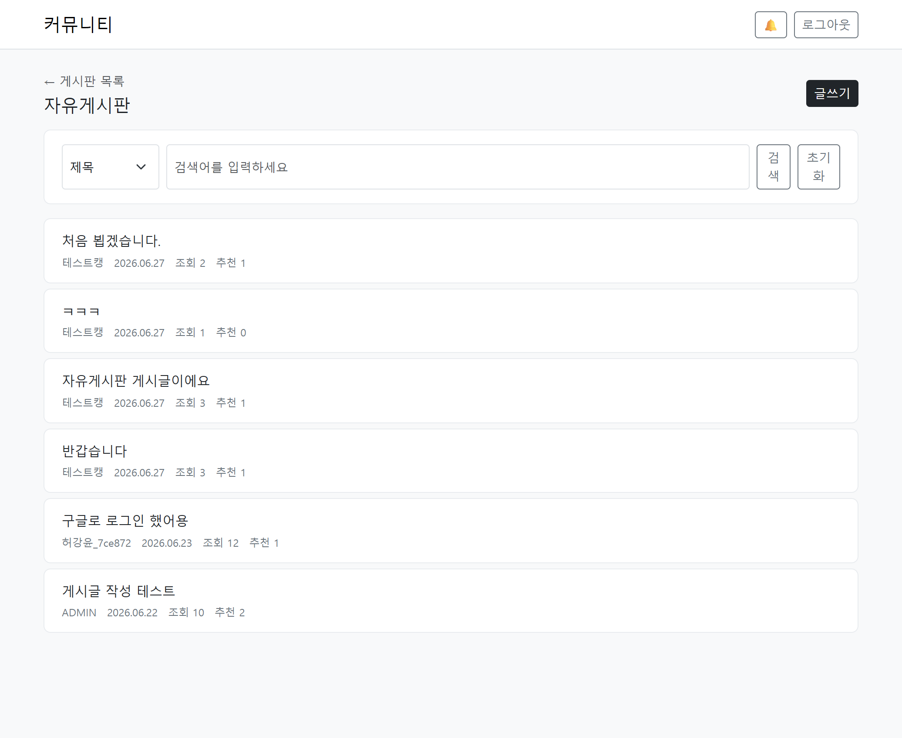
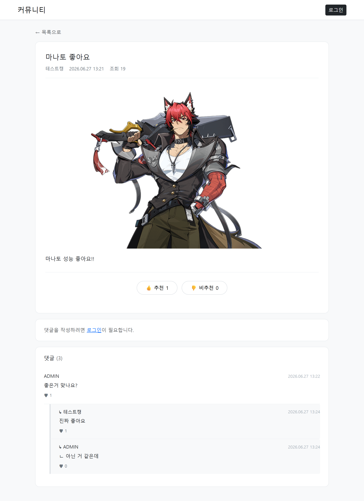
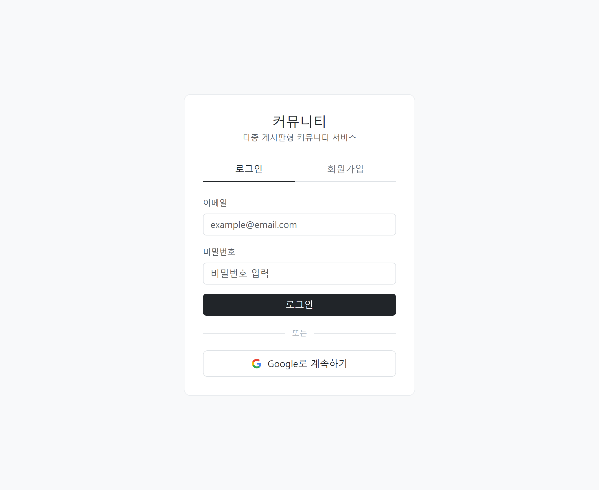
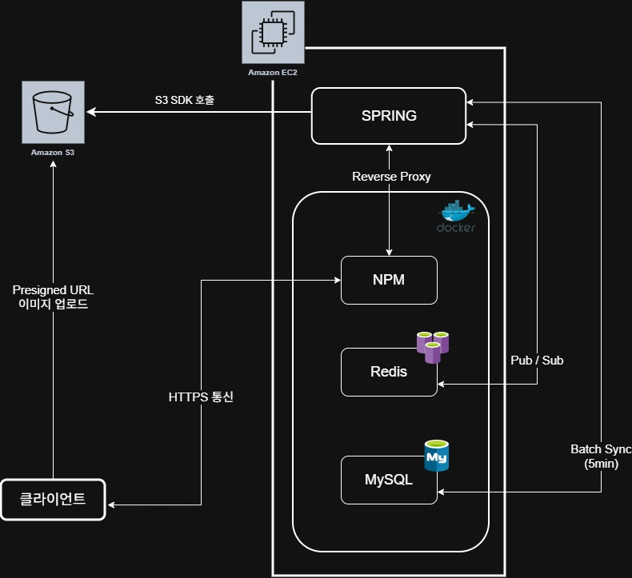
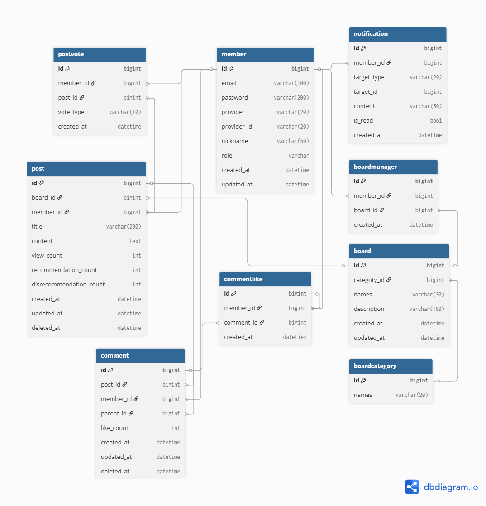

# Community Board

> 다중 게시판 기반 커뮤니티 서비스 — 백엔드 중심 포트폴리오 프로젝트

---

## 🔗 배포 URL

> **[https://yooncommunity.ddnsfree.com](https://yooncommunity.ddnsfree.com)**


## 🔗 Swagger URL

> **[https://yooncommunity.ddnsfree.com/swagger-ui/index.html](https://yooncommunity.ddnsfree.com/swagger-ui/index.html)**


---

## 📸 스크린샷

| 게시글 목록                                                | 게시글 상세                                                | 회원가입 / 로그인 |
|-------------------------------------------------------|-------------------------------------------------------|---|
| __ | __ | __ |

---

## 프로젝트 소개

단순 CRUD를 넘어 실제 운영 환경에서 발생하는 문제들을 직접 설계하고 해결하는 것을 목표로 개발한 커뮤니티 서비스입니다.

디시인사이드, 네이버 카페 등을 참고하여 다중 게시판 운영이 가능한 범용 커뮤니티 구조로 설계하였으며, 인증/인가, 동시성 처리, 실시간 알림, 검색 성능 개선 등 백엔드 핵심 관심사를 직접 경험하는 것에 집중했습니다.

1차 릴리즈에서 핵심 기능 구현을 마친 뒤, 2차 릴리즈에서는 기능 추가보다 **기존 구조의 성능 개선과 안정성 검증**에 집중했습니다. 검색 기능을 FULLTEXT 기반으로 전환하고, Redis 동기화 구조를 리팩터링했으며, k6 부하 테스트를 통해 기존 설계(Redis 기반 카운팅)의 타당성을 실증적으로 검증했습니다.

---

## 기술 스택

| 구분 | 기술                             |
|---|--------------------------------|
| Language | Java 17                        |
| Framework | Spring Boot 3, Spring Security |
| ORM | JPA, QueryDSL                  |
| Database | MySQL 8.0 (FULLTEXT/ngram)     |
| Cache | Redis                          |
| Auth | JWT, OAuth2 (Google)           |
| Storage | AWS S3 (Presigned URL)         |
| Infra | AWS EC2, Docker, Nginx Proxy Manager         |
| Frontend | Vanilla JS, Bootstrap 5        |
| Docs | Swagger (SpringDoc OpenAPI)    |
| Test | JUnit5, BDDMockito, AssertJ, k6 (부하 테스트) |

Frontend 참고사항: 프론트엔드는 Swagger 명세 기반으로 AI 도구를 활용해 작성되었으며, API 동작 확인을 목적으로 합니다.

---

## 시스템 아키텍처



- **Nginx Proxy Manager**: HTTPS 처리 및 리버스 프록시
- **Docker**: MySQL, Redis 컨테이너로 운영 환경 격리

---

## 주요 기능

| 기능 | 설명 |
|---|---|
| 회원 인증 | 로컬 회원가입/로그인, Google OAuth2 소셜 로그인 |
| JWT 인증 | AccessToken + RefreshToken, Redis 기반 RefreshToken 관리, 로그아웃 시 Redis 키 즉시 삭제로 무효화 |
| 다중 게시판 | 게시판 생성/관리, 게시판 관리자 권한 분리 |
| 게시글 | CRUD, S3 이미지 업로드 (Presigned URL), Soft Delete |
| 댓글/대댓글 | 1-depth 대댓글, Soft Delete, 플랫 구조 페이징 |
| 추천/비추천/좋아요 | PostVote (UP/DOWN), CommentLike, Redis 원자 연산 기반 카운팅 |
| 조회수 | Redis 카운팅, dirty-set 패턴 기반 배치 DB 반영, 재시작 시 워밍업 복원 |
| 검색 | MySQL FULLTEXT(ngram parser) 기반 전문 검색, 예약 문자 포함 키워드는 LIKE 기반으로 자동 fallback |
| 실시간 알림 | SSE + Redis Pub/Sub, 댓글/대댓글/추천 이벤트 알림 |
| 테스트 | Service 레이어 단위 테스트, Controller 레이어 슬라이스 테스트, k6 기반 부하 테스트 |

---

## ERD



| 테이블 | 설명 |
|---|---|
| Member | 회원 (로컬 + OAuth2 통합) |
| BoardCategory | 게시판 카테고리 |
| Board | 게시판 |
| BoardManager | 게시판 관리자 권한 |
| Post | 게시글 |
| PostVote | 게시글 추천/비추천 |
| Comment | 댓글/대댓글 (self-reference) |
| CommentLike | 댓글 좋아요 |
| Notification | 알림 |

---

## API 목록

<details>
<summary>Auth</summary>

| Method | URL               | 설명     |
|---|-------------------|--------|
| POST | /api/auth/signup  | 회원가입   |
| POST | /api/auth/login   | 로그인    |
| POST | /api/auth/refresh | 토큰 재발급 |
| POST | /api/auth/logout  | 로그아웃   |

</details>

<details>
<summary>Board</summary>

| Method | URL | 설명 |
|---|---|---|
| GET | /api/boards | 게시판 목록 조회 |
| GET | /api/boards/{boardId} | 게시판 상세 조회 |
| POST | /api/boards | 게시판 생성 |
| PATCH | /api/boards/{boardId} | 게시판 수정 |
| DELETE | /api/boards/{boardId} | 게시판 삭제 |

</details>

<details>
<summary>Post / Image</summary>

| Method | URL | 설명 |
|---|---|---|
| GET | /api/boards/{boardId}/posts | 게시글 목록 조회 (검색/페이징) |
| GET | /api/boards/{boardId}/posts/{postId} | 게시글 상세 조회 |
| POST | /api/boards/{boardId}/posts | 게시글 작성 |
| PATCH | /api/boards/{boardId}/posts/{postId} | 게시글 수정 |
| DELETE | /api/boards/{boardId}/posts/{postId} | 게시글 삭제 |
| POST | /api/boards/{boardId}/posts/{postId}/vote | 게시글 추천/비추천 |
| POST | /api/images/presigned-url | S3 Presigned URL 발급 |

</details>

<details>
<summary>Comment</summary>

| Method | URL | 설명 |
|---|---|---|
| GET | /api/boards/{boardId}/posts/{postId}/comments | 댓글 목록 조회 |
| GET | /api/boards/{boardId}/posts/{postId}/comments/{commentId} | 댓글 상세 조회 |
| POST | /api/boards/{boardId}/posts/{postId}/comments | 댓글 작성 |
| POST | /api/boards/{boardId}/posts/{postId}/comments/{commentId}/replies | 대댓글 작성 |
| PATCH | /api/boards/{boardId}/posts/{postId}/comments/{commentId} | 댓글 수정 |
| DELETE | /api/boards/{boardId}/posts/{postId}/comments/{commentId} | 댓글 삭제 |
| POST | /api/boards/{boardId}/posts/{postId}/comments/{commentId}/like | 댓글 좋아요 |

</details>

<details>
<summary>Notification</summary>

| Method | URL | 설명 |
|---|---|---|
| GET | /api/notifications/subscribe | SSE 연결 |
| GET | /api/notifications | 알림 목록 조회 |
| PATCH | /api/notifications/{notificationId} | 알림 읽음 처리 |


</details>

---

## 성능 개선 및 검증 (2차 릴리즈)

1차 릴리즈 이후 기존 기능의 성능을 실측하고, 설계 선택의 타당성을 직접 검증하는 데 집중했습니다.

### 검색: LIKE → MySQL FULLTEXT(ngram) 전환

- Hibernate 6 `FunctionContributor` + SPI를 통해 FULLTEXT 커스텀 함수를 등록하고, QueryDSL에서 함수명을 직접 호출하는 방식으로 연동했습니다.
- Boolean Mode 전처리 파이프라인(trim → split →단일 문자 필터 → 예약 문자 제거 → `+token` 조립)을 구성했습니다.
- FULLTEXT Boolean Mode에서는 `+`, `-`, `*` 등 예약 문자가 포함된 키워드가 파싱 오류를 유발할 수 있어, 하이브리드 방식이 아니라 **예약 문자 포함 여부로 분기하여 LIKE 검색 중 하나만 실행**하도록 처리했습니다.
- **벤치마크 결과**: 5만 건 데이터 기준 DB 레벨 약 **2.9배**, k6 부하 테스트 기준 API 레벨 약 **1.9배** 성능 개선을 확인했습니다.

### N+1 문제 해결

- 목록 조회에는 QueryDSL `join(entity.member).fetchJoin()`을 적용했습니다.
- 단건 조회에는 `@EntityGraph`를 적용했습니다.

### 조회수/추천수 처리 방식 검증 (Redis vs DB 직접 UPDATE)

기존에 채택한 Redis 기반 카운팅 설계가 단순 성능 이점을 넘어 실제로 필요한 선택이었는지 검증하기 위해, DB를 직접 `UPDATE`하는 방식을 별도로 구현해 k6로 비교 부하 테스트를 진행했습니다. (비교군으로만 구현했으며 실제 프로젝트 코드에는 반영하지 않았습니다.)

- DB 직접 `UPDATE` 방식은 FK 제약과 `UPDATE`가 동시에 경합하는 상황에서 S-lock/X-lock 데드락이 발생해 정상 동작하지 않는 것을 확인했습니다.
- 이를 통해 Redis 기반 설계가 성능뿐 아니라 **동시성 처리 관점에서도 필요한 선택**이었음을 실증적으로 재확인했습니다.

---

## 안정성 개선 (2차 릴리즈)

### Redis 동기화 구조 리팩터링

- 기존 SCAN 기반 배치 동기화를 **dirty-set 패턴**(`SADD`/`RENAME` 원자적 스왑)으로 교체했습니다.
- 동기화 커밋/롤백 방식을 도입하고, 4개의 개별 동기화 메서드를 공통 `syncToDb` 공통 로직으로 통합했습니다.
- 예외 처리 범위를 `Exception`으로 넓혀 동기화 실패 시나리오를 더 폭넓게 포착하도록 했습니다.

### 서버 재시작 시 데이터 정합성 확보

- `ApplicationRunner`를 구현한 `RedisWarmupRunner`를 추가해, 서버 기동 시 배치 조회수를 `MSET`으로 일괄 복원하도록 했습니다.
- 워밍업 도중 미반영 증분이 유실되지 않도록 dirty set을 먼저 플러시한 뒤 덮어쓰는 순서로 처리했습니다.
- 페이지네이션 안정성을 위해 `Sort.by("id").ascending()`을 적용했습니다.

### 로그아웃 / 리프레시 토큰 무효화

- 별도의 블랙리스트 대신, 기존 RTR(Refresh Token Rotation) 화이트리스트 패턴을 활용해 로그아웃 시 Redis의 `refresh:{memberId}` 키를 즉시 삭제하는 방식으로 단순화했습니다.
- 로그인 / 리프레시 / OAuth2 전 구간에서 쿠키 옵션(`sameSite("Lax")` 등)의 일관성을 정리했습니다.

### S3 고아 이미지 정리

- `temp/` prefix 기반으로 임시 업로드 이미지를 구분하고, 정규식 기반으로 본문 콘텐츠를 파싱해 실제 사용 여부를 판별하도록 했습니다.
- `@TransactionalEventListener(AFTER_COMMIT)`에서 트랜잭션 커밋 이후 S3 복사/삭제를 처리하고, 실패 시 최대 3회까지, 대기 시간을 조금씩 늘려가며 재시도하도록 구성했습니다.
- 재시도로도 정리되지 않은 임시 파일은 S3 Lifecycle Rule로 24시간 후 자동 삭제되도록 안전장치를 이중으로 두었습니다.
- 게시글 수정 시 기존 이미지 삭제 로직은 소유권 검증 이슈로 인해 의도적으로 제외했으며, 아래 Known Limitations에 명시했습니다.

---

## 알려진 제한 사항 (Known Limitations)

| 항목 | 내용 | 비고 |
|---|---|---|
| 조회수 증가/dirty set 등록 원자성 미보장 | INCR(조회수 증가)과 SADD(dirty set 등록)가 별개 명령으로 실행되어 그 사이 장애 시 정합성이 깨질 수 있음 | 두 명령을 하나로 묶어 원자적으로 처리하는 방법 검토 예정, 현재는 낮은 우선순위로 보류 |
| 이미지 수정 시 기존 이미지 미삭제 | 게시글 수정 시 이전 S3 이미지를 삭제하지 않음 | 소유권 검증 이슈로 CDN(CloudFront) 도입 이후 재구현 예정 |
| Redis 장애 자동 복구 미지원 | Redis 장애 시 재시작 없이 자동으로 복구되지 않음 | 재시작 시 `RedisWarmupRunner`로 복원되나, 무중단 자동 복구는 미지원 |

---

## 의사결정 기록

### 1. 비관적 락 대신 Redis 원자 연산으로 카운팅 처리

**배경**

이전 프로젝트에서 동시 요청 시나리오를 통합 테스트로 직접 재현했습니다. 동일 사용자가 서로 다른 Todo 항목 4개를 동시에 완료 처리하는 테스트에서 lost update가 발생하는 것을 확인했고, 이후 비관적 락을 적용하여 해결했습니다.

**문제 인식**

커뮤니티 서비스의 조회수, 추천수, 댓글 좋아요는 여러 사용자가 동시에 쓰기 요청을 보내는 빈도가 매우 높습니다. 이 항목들에 비관적 락을 적용하면 경쟁 상황마다 락 대기가 발생하고, 이는 추천 실패, 좋아요 실패 등 사용자 경험 저하로 직결됩니다.

**선택**

Redis의 `INCR` / `DECR` 명령은 단일 스레드 기반으로 원자적으로 실행되기 때문에 락 없이도 동시성 문제를 피할 수 있습니다. 이를 활용하여 조회수, 추천수, 댓글 좋아요 카운트를 Redis에서 관리하도록 설계했습니다.

**데이터 정합성 처리**

- **추천/비추천, 댓글 좋아요**: 원본 DB 테이블(PostVote, CommentLike)을 별도로 두어 중복 여부 판단 및 toggle 처리의 기준 데이터로 활용
- **조회수**: 비즈니스 임팩트가 상대적으로 낮다고 판단하여 배치 sync 시 일부 소실 가능성을 인지한 상태로 운영

**2차 검증**

이 설계 선택이 단순한 이론적 판단이 아니었음을 2차 릴리즈에서 k6 부하 테스트로 직접 검증했습니다. DB 직접 UPDATE 방식을 비교군으로 구현한 결과 FK+UPDATE 동시 경합 상황에서 데드락이 발생해 정상 동작하지 않았고, Redis 기반 설계가 동시성 관점에서도 필요한 선택이었음을 재확인했습니다. (자세한 내용은 [성능 개선 및 검증](#성능-개선-및-검증-2차-릴리즈) 참고)

---

### 2. SSE + Redis Pub/Sub 구조 선택


**문제**

알림 기능은 댓글 작성, 추천 등 여러 비즈니스 로직에서 발생합니다.
비즈니스 서비스에서 Notification 저장과 SSE 전송을 모두 처리하면 서비스가 알림 구현에 강하게 결합되고, 트랜잭션 롤백 시에도 알림이 전송될 수 있는 문제가 있습니다.

또한 `SseEmitter`는 JVM 메모리에 존재하므로 서버를 여러 대로 확장하면 다른 인스턴스에 연결된 사용자에게 직접 이벤트를 전달할 수 없다.

**선택**

Spring Event를 사용해 비즈니스 로직과 알림 처리 로직을 분리했습니다.

이벤트는 `@TransactionalEventListener(AFTER_COMMIT)`에서 처리하여 원본 트랜잭션이 정상적으로 커밋된 이후에만 Notification을 저장하도록 했습니다.

이후 Redis Pub/Sub으로 메시지를 발행하고 Subscriber가 이를 수신하여 `SseEmitter`로 실제 알림을 전송하도록 구성했습니다.

**결과**

- 댓글/추천 서비스는 `publishEvent()`까지만 수행하므로 알림 구현과 결합되지 않습니다.
- Notification 저장과 SSE 전송이 분리되어 역할이 명확해졌습니다.
- 트랜잭션 롤백 시 잘못된 알림 전송을 방지할 수 있습니다.
- 현재는 단일 서버지만, 서버를 여러 대로 확장하더라도 각 서버가 Redis를 통해 메시지를 받아 자신의 `SseEmitter`로 전달할 수 있는 구조를 유지할 수 있습니다.


---

### 3. S3 Presigned URL 방식으로 이미지 업로드

**문제**

이미지를 서버를 경유해서 S3에 저장하면, 클라이언트 → 서버 → S3로 이미지 데이터가 두 번 전송됩니다. 이미지가 많거나 용량이 클수록 서버 네트워크 부하가 커집니다.

**선택**

서버는 S3 Presigned URL만 발급하고, 실제 업로드는 클라이언트가 S3에 직접 수행하도록 했습니다. 서버는 업로드 완료 후 전달받은 이미지 키만 저장하면 되기 때문에 서버 부하를 줄일 수 있습니다.

**추가 처리**

서버 측에서 Content-Type 검증을 수행하여 허용된 이미지 형식 외의 업로드를 차단했습니다.

2차 릴리즈에서는 `temp/` prefix와 `AFTER_COMMIT` 이벤트, S3 Lifecycle Rule을 조합해 업로드는 되었지만 게시글 저장에는 실패한 고아 이미지를 정리하는 구조를 추가했습니다. (자세한 내용은 [안정성 개선](#안정성-개선-2차-릴리즈) 참고)

---

### 4. QueryDSL 도입으로 동적 쿼리 처리

**배경**

게시글 검색 조건(제목, 내용, 작성자)이 런타임에 조합되는 구조였기 때문에 정적 JPQL로는 처리가 번거로웠습니다.

**선택**

QueryDSL의 `BooleanExpression`을 활용하여 각 조건을 독립적인 메서드로 분리하고, null 반환 시 조건에서 제외되는 방식으로 동적 쿼리를 구성했습니다.

추가로 `PageableExecutionUtils.getPage()`를 사용하여 마지막 페이지에서는 count 쿼리를 생략하도록 처리했습니다. 마지막 페이지 조회 시 불필요한 쿼리를 1회 감소할 수 있었습니다.

**장점**

컴파일 시점에 오류를 확인할 수 있어 런타임 쿼리 오류 가능성이 낮고, 조건별로 메서드를 분리할 수 있어 가독성과 재사용성이 높습니다.

**2차 개선**

검색 조건 자체는 QueryDSL의 동적 쿼리 구조를 유지하되, LIKE 대신 FULLTEXT 커스텀 함수를 호출하도록 확장했습니다. (자세한 내용은 [성능 개선 및 검증](#성능-개선-및-검증-2차-릴리즈) 참고)

---

### 5. 도메인 기반 패키지 구조 선택

**배경**

이전 프로젝트에서 레이어 기반 구조(controller / service / repository)를 사용했고, 이번에는 의도적으로 도메인 기반 구조를 선택했습니다.

**경험**

테이블과 도메인 수가 늘어날수록 레이어 기반 구조에서는 특정 도메인 파일을 찾기 위해 여러 레이어를 오가야 하는 과정이 불편한 점이 있었습니다. 도메인 기반으로 패키지를 구성하니 관련 파일이 한 곳에 모여 있어 탐색이 훨씬 편했습니다.

```
src/main/java/com/kangyoon/community
├── domain
│   ├── member        # Member 관련 Controller, Service, Repository, DTO
│   ├── board
│   ├── post
│   ├── comment
│   ├── vote
│   ├── notification
│   └── image
└── global
    ├── config
    ├── security
    ├── exception
    └── common
```

---

## 트러블슈팅

### 1. Redis 카운팅 도입 과정에서 데이터 정합성 문제

#### 문제

조회수, 추천수, 댓글 좋아요는 동시 요청이 빈번하게 발생하는 데이터입니다.

이전 프로젝트에서 동일 데이터에 대한 동시 수정 시 Lost Update 문제를 경험한 적이 있었고, 이를 해결하기 위해 Redis의 원자 연산(`INCR`, `DECR`)을 활용한 카운팅 구조를 도입했습니다.

하지만 구현 과정에서 세 가지 문제를 추가로 마주쳤습니다.

---

#### 문제 1: Redis vs DB 역할 분리

초기에는 Redis를 원본 데이터로 사용하는 방안을 고려했습니다.

```text
Redis INCR → DB 저장
```

하지만 DB 저장이 실패하면 Redis 카운트만 증가한 상태가 되어 불일치가 발생할 수 있었습니다. 반대로 추천 여부 판단을 Redis에만 의존하면 Redis 장애 시 추천 이력 자체를 복구하기 어려웠습니다.

**해결**: 각 저장소의 역할을 분리했습니다.

| 저장소 | 역할 |
|---|---|
| PostVote | 추천/비추천 원본 데이터 (Source of Truth) |
| Redis | 실시간 카운트 조회 |
| Post.recommendCount | 정렬 및 검색 최적화 |

추천 요청 시 PostVote를 먼저 저장하여 정합성을 확보하고, 이후 Redis 카운트를 반영하도록 구성했습니다.

---

#### 문제 2: 추천 처리와 Redis 카운트 반영 순서 문제

게시글 추천은 PostVote를 DB에 저장한 뒤 Redis 추천 수를 증가시킵니다.
동일 사용자가 동시에 추천 요청을 보내는 경우, 트랜잭션 커밋 전까지는 DB의 Unique 제약이 검사되지 않습니다.
이 상태에서 Redis 카운트를 먼저 증가시키면 실제 저장 결과와 Redis 값이 일치하지 않을 수 있습니다.

```text
Redis INCR 성공 → DB 커밋 실패 → Redis 카운트만 증가한 상태로 불일치 발생
```

**고민한 선택지**

- 선택지 1: `@TransactionalEventListener(AFTER_COMMIT)`으로 커밋 이후 Redis 반영
  - DB 정합성은 보장되나 실패 시 어느 시점에서 실패했는지 추적이 어려움
- 선택지 2: `flush()` 명시 후 Redis INCR 호출 (채택)
  - `flush()`로 DB insert를 먼저 반영 한 뒤 Redis INCR 호출
  - Redis INCR 실패 시 예외가 전파되어 트랜잭션 롤백으로 DB도 취소됨
  - 실패 지점이 명확하고 오류 추적이 용이
  - 향후 `AFTER_COMMIT` 이벤트 리스너로 리팩터링 예정


**선택한 이유**
당시에는 Spring Event를 사용하지 않았고, 동기적으로 실패 지점을 추적하는 것이 더 중요하다고 판단했습니다.
따라서 flush() 기반의 동기 처리 방식을 선택했습니다.

**추가 고려**
이후 SSE를 구현하면서 @TransactionalEventListener를 사용해보니 관심사 분리와 보상 처리 측면의 장점도 이해하게 되었습니다.
현재는 동일 사용자의 동시 추천 가능성이 매우 낮다는 점과 flush()의 추가 DB 통신 비용을 고려해 AFTER_COMMIT 기반으로 리팩터링하는 방향도 검토하고 있습니다.
이 경우 DB는 이미 커밋된 상태이므로 Redis 갱신 실패에 대해서만 재시도, 배치, 메시지 큐 등을 이용한 보상 처리를 적용할 수 있습니다.

> **회고 (2차 릴리즈 반영)**: 이 문제에서 실제로 개선이 필요했던 지점은 `flush()` 호출 자체가 아니라, "Redis 반영이 DB 트랜잭션과 동기적으로 묶여 있어야 한다"는 설계 전제 자체였습니다. 2차 릴리즈에서는 조회수 동기화 구조를 SCAN 기반 배치에서 dirty-set 패턴(`SADD`/`RENAME` 원자적 스왑)으로 리팩터링하면서, 커밋/롤백 방식을 명확히 하고 4개 동기화 메서드를 공통 `syncToDb` 공통 로직으로 통합했습니다. (자세한 내용은 [안정성 개선](#안정성-개선-2차-릴리즈) 참고)

---

#### 문제 3: 목록 조회 시 카운트 N+1 문제

게시글 목록 조회 시 게시글마다 개별 Redis GET을 호출하면 페이지당 최대 60개(추천수 + 비추천수 + 조회수)의 Redis 호출이 발생합니다. Redis 장애 시 캐시 미스로 처리되면 동일한 수의 DB 쿼리가 발생합니다.

**해결**: `MGET`으로 목록 전체를 한 번에 조회하고, 캐시 미스된 ID만 DB에서 일괄 조회 후 Redis에 적재하도록 구성했습니다.

```text
MGET(postIds) → 캐시 미스 ID 추출 → DB 일괄 조회 → Redis 적재 → 결과 반환
```

---

#### 현재 한계 (2차 릴리즈 시점)

서버 재시작 시 데이터 정합성 문제는 `RedisWarmupRunner`(`MSET` 기반 일괄 복원, dirty set 우선 플러시)로 해결했습니다. 다만 아래 항목은 여전히 남아 있습니다.

- `INCR`(조회수 증가)과 `SADD`(dirty set 등록)가 원자적으로 묶여 있지 않아, 그 사이 장애가 발생하면 정합성이 깨질 수 있습니다. (현재는 낮은 우선순위)
- Redis 장애 시 `redisTemplate` 호출 자체에서 예외가 발생하며, 재시작 없는 자동 복구는 지원하지 않습니다.

---

#### 배운 점

Redis는 빠른 조회를 위한 캐시로 활용하고, 정합성이 중요한 데이터는 영속 저장소(DB)를 기준으로 관리해야 한다는 점을 배웠습니다.

또한 Redis를 도입하면 장애 대응, 캐시 미스 처리, 호출 순서 등 추가로 관리해야 할 복잡도가 늘어난다는 점을 직접 경험했습니다.

2차 릴리즈에서 SCAN 기반 동기화를 dirty-set 패턴으로 교체하면서, 문제가 발생했을 때 "무엇을 고칠지"보다 먼저 "애초에 이 설계 전제가 맞았는지"를 되짚어보는 습관의 중요성을 다시 확인했습니다.

---

### 2. AFTER_COMMIT 이벤트에서 알림 저장이 수행되지 않는 문제

#### 문제

댓글 작성 후 알림을 생성하기 위해 `@TransactionalEventListener(AFTER_COMMIT)`를 사용했지만, 이벤트 리스너 내부에서 수행한 `notificationRepository.save()`가 실제 INSERT 쿼리로 반영되지 않는 문제가 발생했습니다.

#### 원인

`AFTER_COMMIT` 시점에는 기존 트랜잭션이 이미 종료된 상태입니다.

따라서 별도의 트랜잭션 없이 수행한 JPA 저장 작업은 flush되지 않았고, 결과적으로 데이터베이스에 반영되지 않았습니다.

#### 해결

알림 저장 로직에 새로운 트랜잭션을 시작하도록 설정했습니다.

```java
@Transactional(propagation = Propagation.REQUIRES_NEW)
```

이를 통해 원본 비즈니스 트랜잭션과 독립적으로 알림 저장이 수행되도록 변경했습니다.

#### 결과

댓글 작성이 정상적으로 커밋된 이후에만 알림이 생성되도록 처리할 수 있었으며, 알림 실패가 댓글 작성 실패로 이어지지 않도록 분리할 수 있었습니다.

#### 배운 점

트랜잭션 이벤트는 단순한 비동기 호출이 아니라 트랜잭션 생명주기와 밀접하게 연결되어 있다는 점을 이해하게 되었고, `AFTER_COMMIT` 환경에서 별도 트랜잭션이 필요한 이유를 학습할 수 있었습니다.

---

### 3. Spring Security 인증 실패 시 401 대신 403이 반환되는 문제

#### 문제

인증이 필요한 API에 토큰 없이 요청했을 때 예상했던 401 Unauthorized가 아닌 403 Forbidden 응답이 반환되었습니다.

#### 원인

Spring Security는 기본 설정 상태에서 인증 실패와 인가 실패를 명확하게 구분하지 않아 의도한 응답을 반환하지 않았습니다.

#### 해결

커스텀 `AuthenticationEntryPoint`를 구현하여 인증되지 않은 요청에 대해 명시적으로 401 응답을 반환하도록 설정했습니다.

```java
.exceptionHandling(exception -> exception
    .authenticationEntryPoint(jwtAuthenticationEntryPoint))
```

#### 결과

미인증 요청은 401, 권한 부족 요청은 403으로 구분하여 반환하도록 수정할 수 있었고, API 사용자 입장에서 응답 의미가 명확해졌습니다.

#### 배운 점

Spring Security의 인증(Authentication)과 인가(Authorization)가 서로 다른 단계에서 처리된다는 점을 이해하게 되었으며, HTTP 상태 코드 설계의 중요성을 경험할 수 있었습니다.

---

### 4. FULLTEXT Boolean Mode에서 예약 문자로 인한 검색 쿼리 파싱 오류

#### 문제

LIKE 기반 검색을 MySQL FULLTEXT(ngram) 기반으로 전환하는 과정에서, 검색어에 `+`, `-`, `*` 등 Boolean Mode의 예약 문자가 포함되면 쿼리 파싱 오류가 발생하거나 의도하지 않은 검색 결과가 반환되었습니다.

#### 원인

FULLTEXT Boolean Mode는 `+`(포함 필수), `-`(제외), `*`(와일드카드) 등의 문자를 검색 연산자로 해석합니다. 사용자가 입력한 검색어에 이런 문자가 포함되면, 이를 일반 텍스트가 아닌 연산자로 파싱하면서 쿼리가 깨지거나 예상과 다른 결과를 반환했습니다.

#### 해결

두 방식을 동시에 사용하는 하이브리드 구조 대신, **검색어에 예약 문자가 포함되어 있는지에 따라 분기하여 둘 중 하나만 실행**하도록 설계했습니다.

- 예약 문자가 없는 일반 검색어: trim → split → 단일 문자 필터 → `+token` 조립의 전처리 파이프라인을 거쳐 FULLTEXT Boolean Mode로 검색
- 예약 문자가 포함된 검색어: 기존 LIKE 검색으로 fallback

#### 결과

예약 문자가 포함된 검색어도 오류 없이 처리하면서, 대부분의 일반 검색어는 FULLTEXT의 성능 이점을 그대로 누릴 수 있었습니다. 벤치마크 결과 5만 건 데이터 기준 DB 레벨 약 2.9배, k6 부하 테스트 기준 API 레벨 약 1.9배 성능이 개선되었습니다.

#### 배운 점

성능 개선을 위해 도입한 기술이 항상 이전 방식을 완전히 대체할 수 있는 것은 아니며, 입력값의 예외 케이스를 먼저 정의하고 그에 맞는 분기/fallback 전략을 설계하는 것이 안정적인 전환의 핵심이라는 점을 배웠습니다.

---

## 테스트

- JUnit5 + BDDMockito + AssertJ 기반
- Service 레이어 단위 테스트
- Controller 레이어 슬라이스 테스트 (`@WebMvcTest` + `TestSecurityConfig`)
- k6 기반 부하 테스트: 검색 API 응답 성능 비교, Redis vs DB 직접 UPDATE 방식 동시성 비교

---

## Git 전략

- `main` / `dev` 브랜치 분리
- `feature/`, `fix/` 브랜치 단위 개발

개인 프로젝트지만 협업 환경을 고려한 브랜치 전략과 커밋 컨벤션을 유지했습니다.

---

## 향후 계획

- DB 내부 동작(실행 계획, 쿼리 옵티마이저) 학습 및 이를 반영한 추가 튜닝
- CDN(CloudFront) 도입 후 S3 이미지 삭제 로직 재구현
- 게시판 관리자 신청 시스템
- 신고 기능